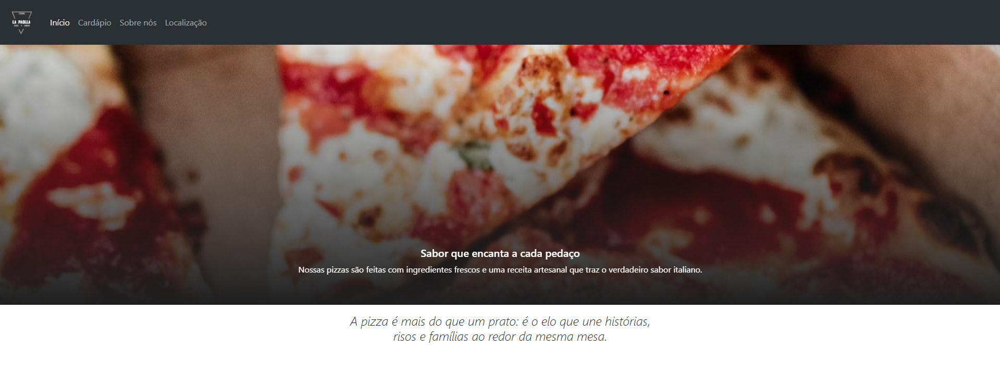
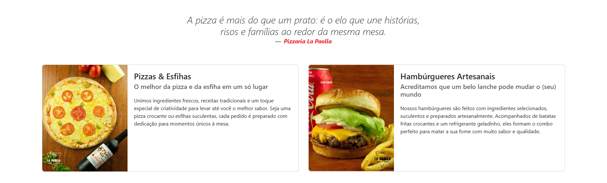
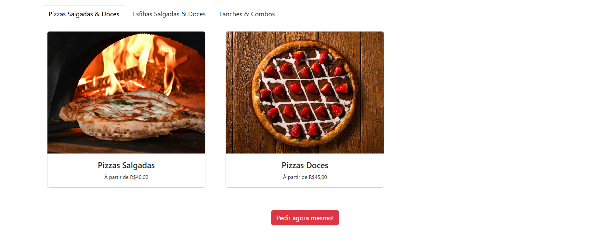
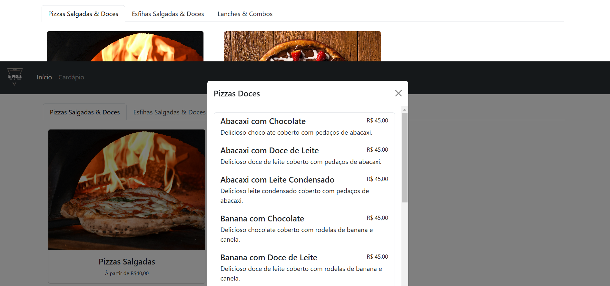
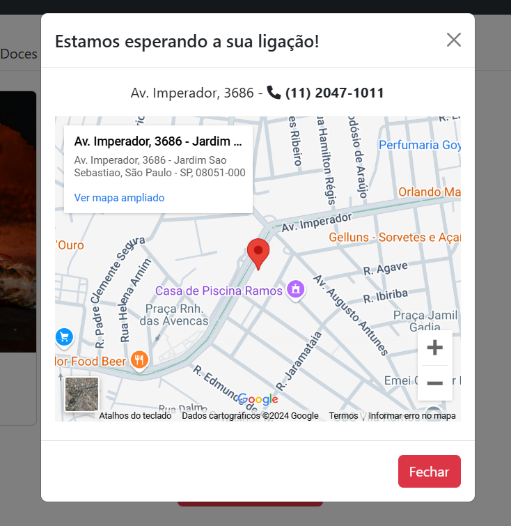

# Landing Page - Pizzaria La Paolla

Este projeto foi desenvolvido utilizando **HTML**, **CSS** e **Bootstrap**. É o meu primeiro projeto utilizando um framework e é muito importante destacar a economia de tempo que o Bootstrap pode proporcionar.

---

## Funcionalidades

- **Design Responsivo**: Compatível com dispositivos móveis, tablets e desktops.
- **Componentes Bootstrap**: Uso de botões, cards, carrossel e navbar.
- **Customização CSS**: Estilização adicional para complementar o Bootstrap.

---

## Capturas de Tela

---

## Desafios Enfrentados

- Ao dar andamento no desenvolvimento do projeto, tive algumas dificuldades na leitura da documentação ofical do framework, buscando também alternativas para material de apoio em vídeos e no ChatGPT.
- Estilização: Mesclando o estilo inline com o externo, algumas linhas de código foram escritas com CSS puro. Não necessariamente estando errado, mas sendo uma alternativa em momentos de dúvida.
- Integração com a API do banco de imagens Unsplash: Ao decorrer do projeto, pensei em adicionar no cardápio todos os sabores reais de pizza que há no estabelecimento no formato de cards. Para isso, cheguei a integrar a API do Unsplash afim de gerar imagens aleatórias, porém decidi optar por deixar o cardápio mais otimizado e trabalhar com modais (ainda não desenvolvidos).

---

## Contato

- **Fernando Carini**  
- **E-mail**: [fernando2015lk@gmail.com](mailto:fernando2015lk@gmail.com)  
- **LinkedIn**: [Meu Perfil](https://www.linkedin.com/in/fscarini/)
